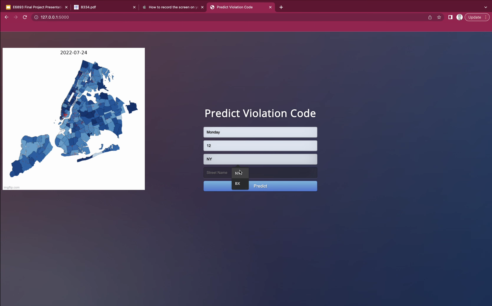
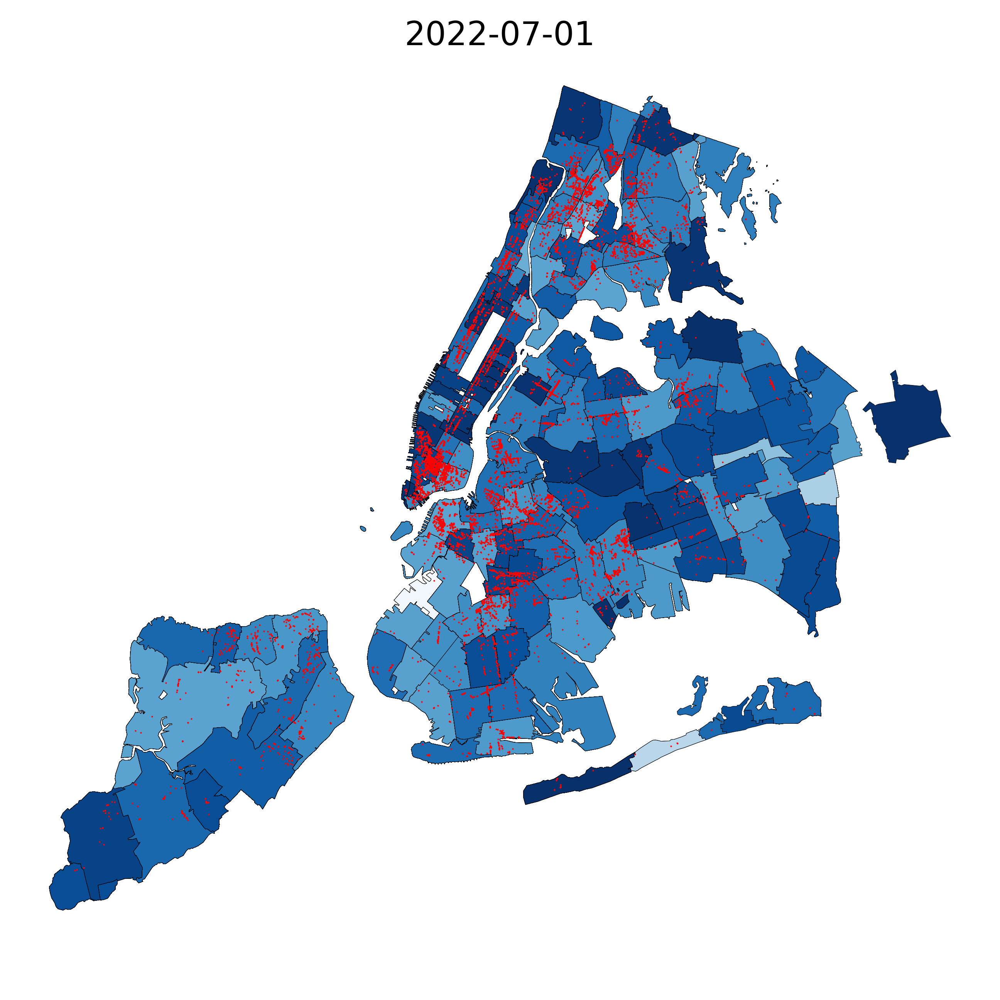

# 202212-21-NYC-Violation-Tickets-Analysis

## Pre-request
Model Download: Download rfc_model.pkl to ./App (https://drive.google.com/drive/folders/12UY_VU3023LWKIQEkLbQAM1dvJBrxuny?usp=sharing)

Violation Dataset Download: Download data of Violations in NYC from 2022 to 2023 (https://data.cityofnewyork.us/City-Government/Parking-Violations-Issued-Fiscal-Year-2023/pvqr-7yc4) and Name it with Parking_Violations_Issued_-_Fiscal_Year_2023.csv to ./Data/data/Parking_Violations_Issued_-_Fiscal_Year_2023.csv

## Precition System
Input Your Parking Street Name, County, Time of Parking and Day of the Week, the system will predict the potential violation type and the fine. 
Install the package in requirements.txt first, run app.py to start the system

## Data Processing
The data cleaning and mapping violation to geographical location is in main.ipynb file, producing "nyc-merged-data-all.csv" file for further process.

